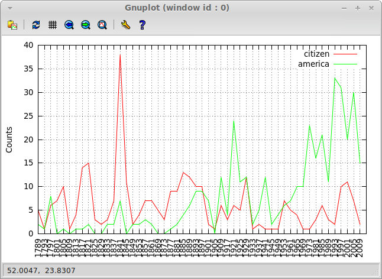
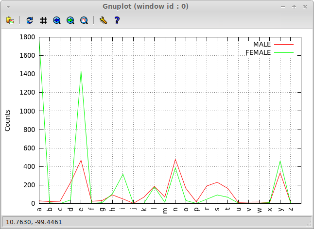

# NLTK 2.2 - Conditional Frequency Distributions

What is a conditional frequency distribution? From a statistical point
of view, it is a function of 2 arguments - a condition and a concrete outcome -
producing an integer result that is a frequency of the outcome's occurence
under the condition. The simplest variant of such function is a table.

In object-oriented programming there's a tendency to put everything
in a program in objects, including functions,
and NLTK authors took the same route by creating a `ConditionalFreqDist` class.
Yet, in my view, it is quite dubious and I have a hard time
with such objects. What we really need here is just a protocol
to work with tables. At the same time there's a classic separation of concerns
issue here, as this protocol shouldn't mandate the internal representation
or a way to generate different values in the distribution.
This is where object come to the rescue in OOP: they allow you to
change the value storage/generation policy via subclassing.
But, as Joe Armstrong has wittily pointed,
"you wanted to have a banana, but got a gorilla holding a banana"...

So, let's get to the protocol part for which a proper concept in OOP languages
will be an interface. Its main operations are:
creating a distribution and examining it (tabulating, plotting, etc.)

## Creating a distribution

Let's create a CFD from the Brown corpus. Remember that
its topics are the following (and they'll become the conditions of our CFD):

    NLTK> (keys (corpus-groups +brown-corpus+))
    (:PRESS-REPORTAGE :PRESS-EDITORIAL :PRESS-REVIEWS :RELIGION
     :SKILL-AND-HOBBIES :POPULAR-LORE :BELLES-LETTRES
     :MISCELLANEOUS-GOVERNMENT-HOUSE-ORGANS :LEARNED :FICTION-GENERAL
     :FICTION-MYSTERY :FICTION-SCIENCE :FICTION-ADVENTURE :FICTION-ROMANCE
     :HUMOR)

Let's create the simplest distribution:

    NLTK> (make-cfd (maptable (lambda (topic texts)
                                (declare (ignore topic))
                                (mapcar #'token-word
                                        (flatten (mapcar #'text-tokens texts))))
                              (corpus-groups +brown-corpus+)))
    #<HASH-TABLE :TEST EQL :COUNT 15 {101AA320A3}>
    NLTK> (defvar *cfd* *)

We'll use a very concrete hash-table representation for the distribution,
and we can go a very long way with it.
Although, later we'll see how to deal with other representations.

There's a new utility here, `maptable`, that is an equivalent of `mapcar`
in its simple form, when it works with a single list,
but operating on hash-table instead.
(And, being a generic function, it can also operate on any other
table-like structures).

Each frequency distribution in a CFD is an instance of `ngrams` class
that we've worked with in the previous chapter:

    NLTK> (~ *cfd* :fiction-romance)
    #<TABLE-NGRAMS order:1 count:8451 outcomes:70022 {101C030083}>

Another new utility here, `~`, is an alias to
the generic element access operator `generic-elt`
that is meant to provide uniform access to elements of different
linguistic structures that are defined throughout `CL-NLP`.
It's the analogue of `[]` access operator in Python and other C-like
languages, with the upside that it's not special — just a function.
And it also supports chaining using the generic-function `:around`
method-combination:

    (defgeneric generic-elt (obj key &rest keys)
      (:documentation
       "Generic element access in OBJ by KEY.
        Supports chaining with KEYS.")
      (:method :around (obj key &rest keys)
        (reduce #'generic-elt keys :initial-value (call-next-method obj key))))

As you can see, a lot of utilities, including very generic ones,
are defined along the way of our exploration. Most of them or similar ones
come built into Python. This can be seen as a failure of Lisp standard
at the first sight. Yet it may as well be considered a win, because it's
so easy to add these things on top of the existing core
with generic functions and macros, and there's no issue of
"second-class citizenship". In Python the `[]` operator comes pre-built:
you can redefine it with special hooks but only in one way, you can't
have different `[]` implementations for one class.
The other benefit of Lisp's approach is more control:
you can go with the fast functions that work directly with the concrete
data-structures, like `mapcar` for lists or `gethash` for hash-table.
Or you can use a generic operator and pay the price of generic dispatch:
standard `map` for abstract sequences or user-defined `~` etc,
when you need future extensibility.

So, we can also use `generic-elt` to access individual frequency in the CFD:

    NLTK> (~ *cfd* :fiction-romance "could")
    193

For the first key it will be mapped to hash-table accessor (`gethash`)
and for the second to the method `freq` of the `ngrams` object.

## Examining the distribution

Now, we can move to the more interesting part: analysing the distribution.

The first way to explore the CFD shown in NLTK book is tabulating.
It prints the distribution values in a nice and readable 2D table.

    NLTK> (tabulate *cfd*
                    :conditions '(:press-reportage :religion :skill-and-hobbies
                                  :finction-science :fiction-romance :humor)
                    :samples '("can" "could" "may" "might" "must" "will"))

                         can  could  may  might  must  will
        PRESS-REPORTAGE   93     86   66     38    50   389
               RELIGION   82     59   78     12    54    71
      SKILL-AND-HOBBIES  268     58  131     22    83   264
        FICTION-ROMANCE   74    193   11     51    45    43
                  HUMOR   16     30    8      8     9    13

And, by the way, here's how we can get the individual numbers for one category:

    NLTK> (dolist (m '("can" "could" "may" "might" "must" "will"))
            (format t "~A: ~A " m (~ *cfd* :press-reportage m)))
    can: 93 could: 86 may: 66 might: 38 must: 50 will: 389

Interestingly enough, these results differ from NLTK's ones:

    can: 94 could: 87 may: 93 might: 38 must: 53 will: 389

What's the reason? The answer is case-sensitivity. Let's try the same with
the case-insensitive version of the CFD:

    NLTK> (let ((cfd (make-cfd (maptable (lambda (topic texts)
                                           (mapcar #`(string-downcase (token-word %))
                                                   (flatten (mapcar #'text-tokens
                                                                    texts))))
                                         (corpus-groups +brown-corpus+)))))
            (dolist (m '("can" "could" "may" "might" "must" "will"))
              (format t "~A: ~A " m (~ cfd :press-reportage m))))
    can: 94 could: 87 may: 93 might: 38 must: 53 will: 389

Now, there's an exact match :)

The printing of each row in `tabulate` is performed in the following loop:

    (dotable (k v table)
      (when (or (null conditions)
                (member k conditions))
        (format stream "  ~V:@A" key-width k)
        (let ((total 0))
          (dolist (s samples)
            (format stream "  ~V:@A" (strlen s)
                    (funcall (if cumulative
                                 #`(incf total %)
                                 #'identity)
                             (or (~ v s) 0)))))))

It has to account for scenarios when conditions may or may not be provided,
as well as to treat cumulative output.

And, finally, let's draw some nice pictures. But first we need to create
the inaugural corpus from individual texts:

    (defparameter *inaugural* (make-corpus-from-dir
                               "Inaugural speeches corpus"
                               (data-file "../nltk/data/inaugural/")
                               :test #`(re:scan "^\\d+" %)))

To do that we introduce the function `make-corpus-from-dir`
in the `ncorpus` package that walks the directory of raw text files
and creates a basic corpus from them.

    (let (texts)
      (fad:walk-directory dir
                          #`(when (funcall test (pathname-name %))
                              (push (pair (pathname-name %)
                                          (read-file %))
                                    texts)))
      (make-corpus
       :desc name
       :texts (mapcar #`(make-text
                         :name (l %) :raw (r %)
                         :tokens
                         (mapcar #`(ncore:make-token :word %)
                                 (mapcan #`(ncore:tokenize ncore:<word-tokenizer> %)
                                         (ncore:tokenize ncore:<sentence-splitter>
                                                         (r %)))))
                      texts))

(Here, `pair`, `l`, and `r` are yet another generic utility group —
the equivalents of `cons`, `car`, and `cdr`).

Now, we need to make a CFD from the corpus. It is somewhat complicated,
because the corpus is keyed by text names, and we want a CFD keyed by words:

    (make-cfd (let ((ht (make-hash-table :test 'equalp)))
                (dolist (text (corpus-texts *inaugural*))
                  (let ((year (sub (text-name text) 0 4)))
                    (dolist (word (mapcar #'token-word (text-tokens text)))
                      (when-it (find word '("america" "citizen")
                                     :test #`(search %% % :test 'string-equal))
                        (set# it ht (cons year (get# it ht)))))))
                ht)
              :eq-test 'equalp)

And now, we can plot it:

   NLTk> (plot-table *)

Once again, plotting is performed with `gnuplot`. This time, though,
with a general `plot-table` function that is able to handle any
table-like structure. Here is its code:

    (defun plot-table (table &rest args
                       &key keys cols cumulative (order-by (constantly nil)))
      "Plot all or selected KEYS and COLS from a TABLE.
       CUMULATIVE counts may be used, as well as custom ordering with ORDER-BY."
      (mv-bind (file cols-count keys-count)
          (apply #'write-tsv table args)
          (let ((row-format (fmt "\"~A\" using ~~A:xtic(2) with lines ~
                                  title columnheader(~~:*~~A)"
                                 file)))
            (cgn:with-gnuplot (t)
              (cgn:format-gnuplot "set grid")
              (cgn:format-gnuplot "set xtics rotate 90 1")
              (cgn:format-gnuplot "set ylabel \"~@[Cumulative ~]Counts\"" cumulative)
              (cgn:format-gnuplot "plot [0:~A] ~A"
                                  cols-count
                                  (strjoin "," (mapcar #`(fmt row-format (+ 3 %))
                                                       (range 0 keys-count))))))
          (delete-file file)))

A generic function `write-tsv` creates a temporary file in tab-separated format.
Here, we use its method for `hash-table` objects
(which in our case represent a CFD —
each condition is a key and each sample is a column).
So, the TSV file's contents for our last distribution look like this:

    No Label citizen america
    0 1789 5 2
    1 1793 1 1
    ...

## Using different data sources

Finally, as promised, here's how to use the newly developed CFD machinery
with other ways to obtain raw data for the distribution.
Oftentimes, it's infeasible to read the whole contents of some files in memory,
i.e. it makes sense to use line-by-line processing.
There's a handy `dolines` macro that allows just that.
Let's see, how we can use it to build the male/female names last letters
distribution from NLTK Figure 2.10.

First of all, we can just use it when we create the distribution:

    (make-cfd (let ((ht (make-hash-table)))
                (dolist (gender '(:female :male))
                  (dolines (word (fmt "../nltk/data/names/~(~A~).txt" gender))
                    (let ((last-char (char word (1- (length word)))))
                      (when (alpha-char-p last-char)
                        (set# gender ht
                              (cons last-char (get# gender ht)))))))
                ht))

And here's the plot of the distribution for reference:

    (plot-table * :order-by 'char<)

Another approach would be to use a proxy object,
that allows to pull data for a CFD from a list of files:

    (defclass file-list ()
      ((files :initarg :files :reader files)))

and specialize `make-cfd` generic function for it
(adding a `transform` keyword argument to be able to manipulate file data):

    (defmethod make-cfd ((raw file-list)
                         &key (eq-test 'equal) (transform 'identity)
                         &allow-other-keys)
      (let ((rez (make-hash-table :test eq-test)))
        (dolist (file (files raw))
          (set# (mkeyw (pathname-name file)) rez
                (make 'table-ngrams :order 1
                      :table (count-ngram-freqs
                              (mapcar transform
                                      (split-sequence-if
                                       #'newline-char-p
                                       (read-file file)
                                       :remove-empty-subseqs t))))))
        rez))

And this is how we would call it:

    (make-cfd (make 'file-list
                    :files (mapcar #`(fmt "../nltk/data/names/~(~A~).txt" %)
                                   '(:male :female)))
              :eq-test 'eql
              :transform #`(char % (1- (length %))))

This looks much heavier than the original approach,
but sometimes it may be inevitable.

Yet another way is to use a different plotting function that
dynamically builds the plot as it pulls data. This will require
different style of communication with `gnuplot`:
not via a temporary file, but giving commands to it dynamically.
This is left as an exercise to the reader :)

## Parting words

This part was more a discussion of various rather abstract design issues,
than a demonstration of NLP techniques.

Overall, I don't see a lot of value in special treatment of
conditional frequency distributions as it is done in NLTK.
Surely, it's one of the many useful analytic tools,
but I haven't seen such objects used in production code.
Unlike conditional frequencies per se or ngrams that are all over the places.
